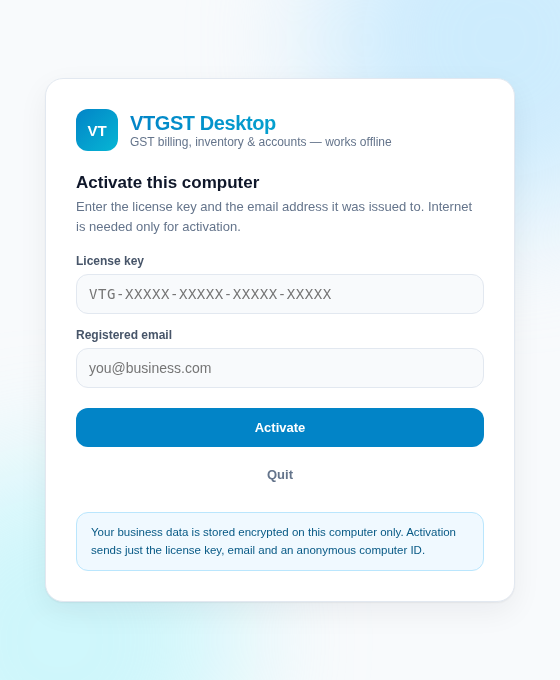
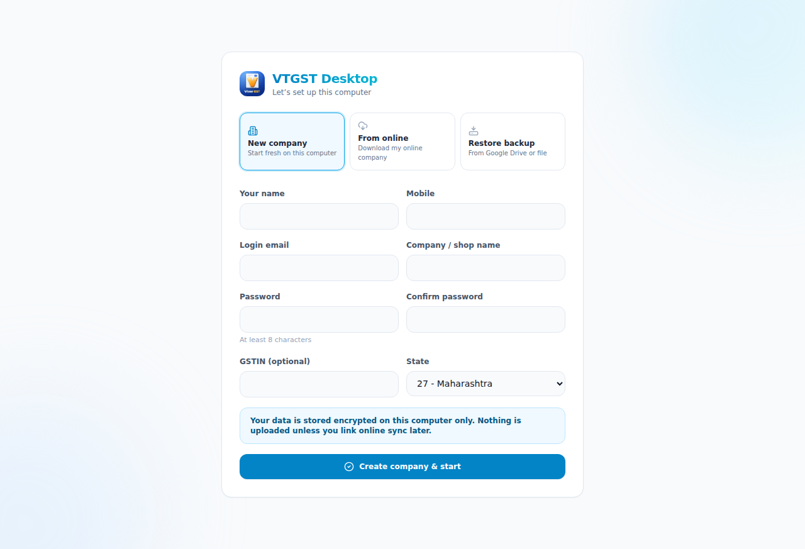
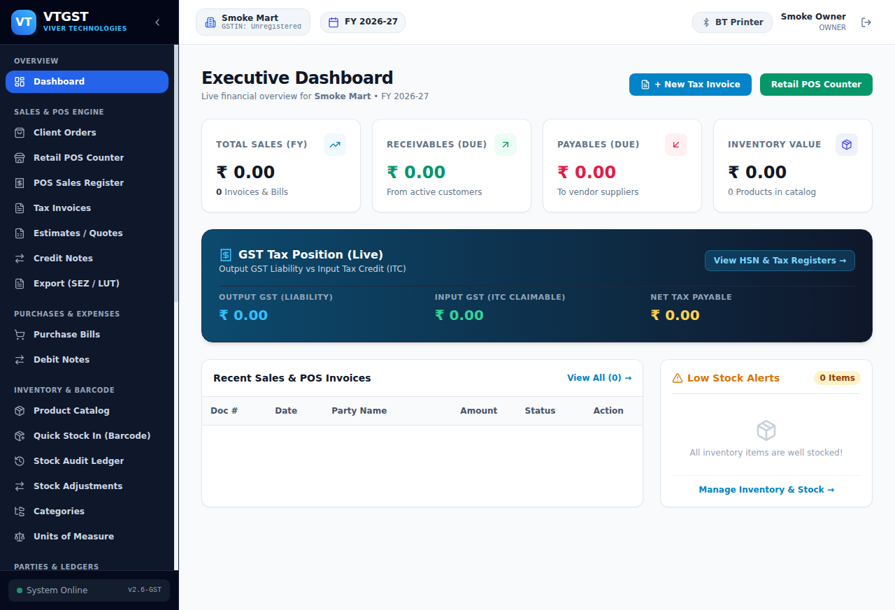
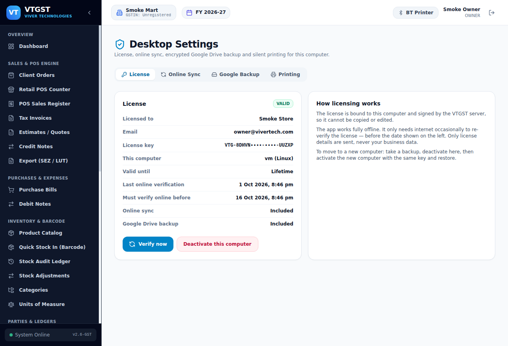

# VTGST Desktop (offline)

Electron desktop edition of VTGST. It runs **the same screens and colours as the online app**, stores every byte of business data in an **encrypted local SQLite database**, and works with no internet at all.

| Activation | First run | Dashboard | Desktop settings |
|---|---|---|---|
|  |  |  |  |

## What it does

- **Independent offline app.** Data lives only on this computer (SQLCipher / AES-256), unless the owner chooses to join online.
- **Licenses managed on the server.** Each computer is activated with a license key + registered email. Tokens are signed by the server (Ed25519), bound to the machine and its device key, and must be re-verified online periodically (default every 15 days, set per license). Clock roll-back, copied installations, forged/edited tokens, modified app files, revoked licenses and seat limits are all enforced. See [docs/SECURITY.md](docs/SECURITY.md).
- **Join online (optional).** *Settings → Online Sync* uploads a company to the owner's online VTGST account and keeps it in two-way sync. The desktop stays local-first: without internet everything is saved locally and uploaded automatically when the connection returns. See [docs/SYNC.md](docs/SYNC.md).
- **Encrypted Google Drive backup.** Only the licensed email can be connected. Backups go to the hidden app folder of that Drive, encrypted with AES-256-GCM using the backup password **plus** a per-license secret held by the server. Local-folder and save-to-file backups use the same format. See [docs/BACKUP.md](docs/BACKUP.md).
- **Silent printing.** Every Print button routes through Electron; with *silent print* on it prints straight to the chosen A4 / thermal receipt printer without a dialog.

## Repository layout

```
app/, components/, lib/, public/   Same Next.js UI as the online app (synced from vtgstnew)
  app/desktop/*                    Desktop-only screens: setup, settings, lock, recovery
  app/api/local/*                  Desktop-only local APIs (setup, sync control, reference import)
  lib/desktop-local/*              Runtime, license check, sync client, raw SQLite apply
  lib/desktop-sync/*               Sync registry + serialization (identical copy in vtgstnew)
  lib/db.ts, lib/auth.ts, lib/s3.ts  Desktop replacements (encrypted SQLite, license-based features, encrypted local files)
  middleware.ts                    Per-launch secret, license lock, online-only route redirects
electron/                          Main process: vault, fingerprint, license, server host, backup, print, IPC
electron-static/                   Activation screen + icon (packed into app.asar)
installer/                         Installer/app icon used by electron-builder
desktop-server/server-entry.js     Embedded server entry: migrations, Next.js start, backup export/restore
packages/better-sqlite3-cipher-shim  Makes Prisma open the DB encrypted
prisma/upstream.schema.prisma      Copied from online (MySQL)
prisma/schema.prisma               Generated SQLite schema
migrations/                        Generated SQL migrations + sync triggers (applied at app start)
scripts/                           sync-upstream, schema, bundle, build-config
tests/e2e/desktop-e2e.ts           End-to-end test against a running online server
```

## Prerequisites

- Node.js 22, npm 10
- The online app deployed with the desktop APIs (see `vtgstnew/docs/DESKTOP_LICENSING_AND_SYNC.md`)
- The Ed25519 **public** key generated there (`npx tsx scripts/generate-desktop-keys.ts` in vtgstnew)

## Develop

```bash
npm install
VTGST_SERVER_URL=https://your-online-domain VTGST_LICENSE_PUBLIC_KEY="$(cat public.pem)" npm run dev
```

`npm run dev` runs `next dev` inside Electron (hot reload). Data for development lives in Electron's userData folder (`%APPDATA%/VTGST Desktop` on Windows).

## Build installers

Easiest: copy `build.env.example` to `build.env` and fill it in, and save the license public key as `license-public.pem` (both in the project root; both are git-ignored). Or set the same names as environment variables (CI secrets). Then build **on the target OS**:

| Variable | Purpose |
|---|---|
| `VTGST_SERVER_URL` | Online VTGST URL (https) used for licensing + sync |
| `VTGST_LICENSE_PUBLIC_KEY` | Ed25519 public key PEM (or its base64) |
| `VTGST_GOOGLE_CLIENT_ID` / `VTGST_GOOGLE_CLIENT_SECRET` | Google OAuth **Desktop app** client (Drive backup). Optional – backup to Drive is hidden without it |
| `CSC_LINK` / `CSC_KEY_PASSWORD` | Code-signing certificate (strongly recommended for Windows SmartScreen) |

```bash
npm ci
npm run dist:win     # Windows NSIS installer -> release/
npm run dist:mac     # macOS dmg
```

`npm run build` = `next build` → `bundle` (assembles `build/server`, writes the integrity manifest) → build config with the manifest hash → compile Electron. electron-builder then applies Electron fuses (no `ELECTRON_RUN_AS_NODE`, no `--inspect`, asar integrity, only load from asar).

### Google Drive setup (once)

1. Google Cloud Console → create a project → enable **Google Drive API**.
2. OAuth consent screen: add scopes `openid`, `email`, `.../auth/drive.appdata`; publish the app.
3. Credentials → *Create OAuth client ID* → **Desktop app**. Use its id/secret for the two variables above.

## Keeping the UI identical to online

```bash
npm run upstream     # copies app/components/lib/public from ../vtgstnew, re-applies desktop patches
npm run schema       # regenerates prisma/schema.prisma, a new migration if the data model changed, and sync triggers
npm run typecheck
```

Online-only areas (super admin, client portal, SaaS billing, signup) are skipped. Desktop replacements are listed in `scripts/sync-upstream.mjs` (`DESKTOP_OWNED`), small edits in `scripts/desktop-patches.mjs`; the script reports any patch that no longer applies.

## Test

The end-to-end test drives the real built server against a running online server (it issues a license through the admin API, activates, sets up, creates invoices, links, syncs both ways, simulates an internet outage, deletes online, backs up/restores and checks license enforcement):

```bash
npm run build:web && npm run bundle
ONLINE_URL=http://127.0.0.1:3000 LICENSE_PUBLIC_KEY_FILE=public.pem \
ADMIN_EMAIL=superadmin@vtgst.com ADMIN_PASSWORD=... OWNER_EMAIL=owner@... OWNER_PASSWORD=... \
npm run test:e2e
```
